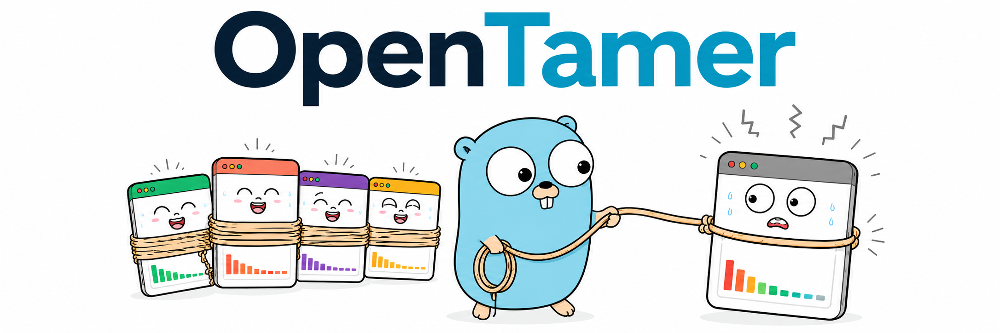
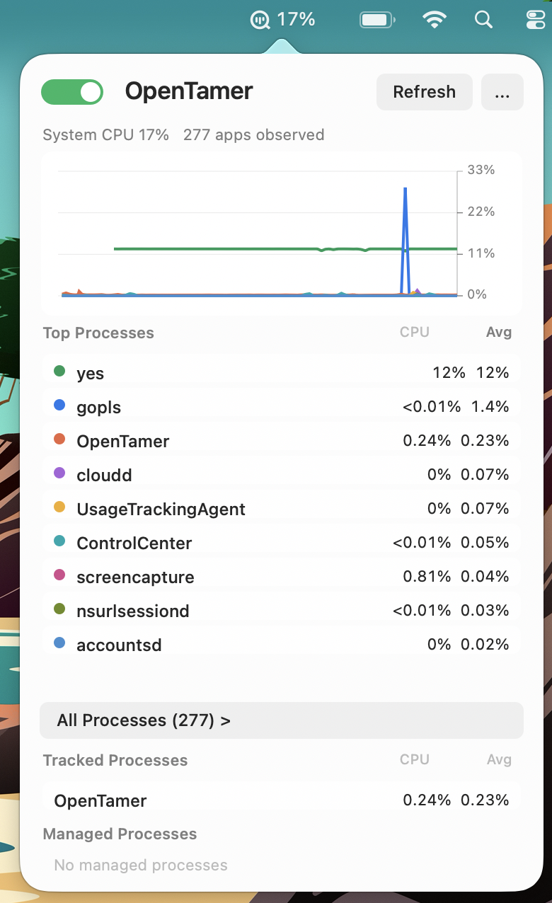
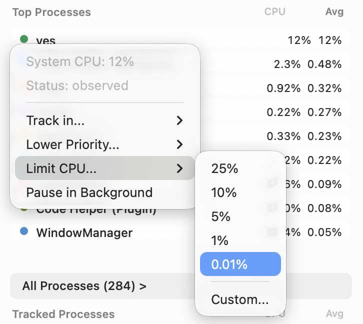
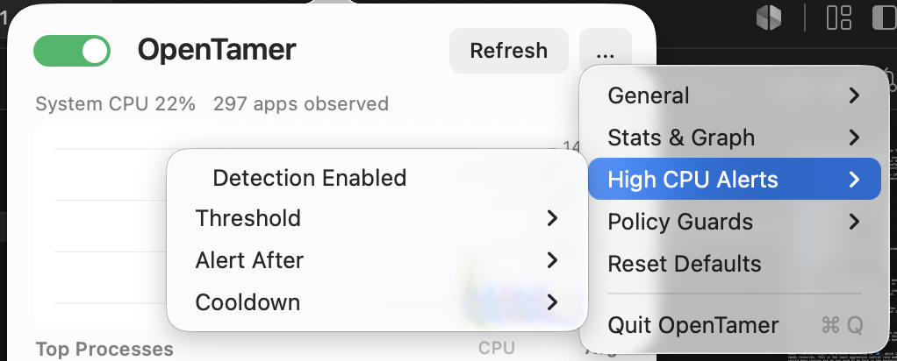

OpenTamer is a local macOS menu bar utility for finding and controlling apps that are using too much CPU. It is a Go
app with no third-party dependencies, using small C bindings for the macOS UI components.

This is useful for the annoying case where an app is still useful, but does not need to be working at full speed while it
is in the background. A browser, indexer, downloader, editor helper, or background utility may be worth keeping open, but
not worth letting it burn through battery or fan noise. OpenTamer can also be used to suppress system processes you are unable
to disable due to system integrity protection but don't desire. 

OpenTamer can track apps, lower their priority, limit their CPU usage, or pause them when they are in the background. It
also tries to restore anything it changed when a rule is removed, management is disabled, or the app exits.

## Table of Contents

- [Menu Bar Functions](#menu-bar-functions)
- [App Management Rules](#app-management-rules)
  - [Track Only](#track-only)
  - [Lower Priority](#lower-priority)
  - [Limit CPU](#limit-cpu)
  - [Pause in Background](#pause-in-background)
- [Preferences](#preferences)
  - [General](#general)
  - [Stats & Graph](#stats--graph)
  - [High CPU Alerts](#high-cpu-alerts)
  - [Policy Guards](#policy-guards)
- [Safety](#safety)
- [Privacy](#privacy)
- [Stored Data](#stored-data)
- [Installation](#installation)
- [Contributing](#contributing)
- [License](#license)

## Menu Bar Functions

The menu bar item shows the current total system CPU. When management is disabled it shows `Off`, and when high CPU has
lasted longer than your configured alert duration the item is marked with `!`.

Tracked apps can also be shown as their own small menu bar items. This is useful when you have one or two apps that you
always want to keep an eye on without opening the full panel.

## App Management Rules

Rules are saved per app and re-applied as OpenTamer refreshes its process list. OpenTamer groups processes by app name by
default, which keeps helper processes together in a way that is usually more useful for menu bar monitoring.

### Track Only

Track only keeps an app visible without controlling it. You can track an app in the macOS menu bar, or in
the "Tracked Processes" section of the OpenTamer menu. Use this for apps you want to watch before deciding whether
they need a stronger rule or just apps you want to keep an eye on.

### Lower Priority

Lower Priority changes the process nice value to `20`, which lets macOS give the app less CPU attention when other work
needs resources. This is the least aggressive control rule and is a good default for browsers, helpers, and apps that
should keep running but do not need to be fast in the background.

Two modes are available:

* `In Background` - Lower priority only while the app is not frontmost.
* `Always` - Keep the lower priority even when the app is frontmost.

### Limit CPU

Limit CPU caps an app to a target CPU percentage using a duty cycle. When an app is above the configured target,
OpenTamer briefly pauses and resumes the process to keep the average closer to the limit. CPU limiting is more
aggressive than lowering priority, but less disruptive than quitting the app. This is useful for apps that ignore
normal priority pressure and keep consuming CPU anyway.

### Pause in Background

Pause in Background stops an app when it is no longer frontmost and resumes it when you return to it. OpenTamer
also hides the app when it is stopped, which keeps the desktop cleaner when the rule is active.

This is the most aggressive rule currently exposed in the UI. It is useful for apps that do not need to do any background
work, but should still be available instantly when selected again.

## Preferences

OpenTamer's preferences are available from the `...` button in the main panel.

### General

General preferences control the shape of the app:

* **Launch at Login** - Start OpenTamer automatically when you log in.
* **Show Menu Icon** - Show or hide the OpenTamer icon next to the CPU text.
* **Aggregate By Name** - Group processes by process name instead of app bundle metadata.
* **CPU Display** - Show app CPU as per-core process CPU by default, or as system-normalized CPU.
* **Wake Grace** - Wait after launch or system wake before applying management rules.

### Stats & Graph

Stats and graph preferences control how often OpenTamer samples CPU and how much history is visible.

* **Stats Interval** - How often OpenTamer refreshes process and CPU data.
* **Averaging Window** - How much recent history is used for average CPU values.
* **CPU Graph Window** - The visible graph range.
* **Top Processes Sort** - Sort by current CPU or by a 60 second average.

### High CPU Alerts

High CPU alerts notify you when an app stays above your configured system CPU threshold long enough to matter. The default
threshold is `75%`, the default duration is `30 seconds`, and the default cooldown is `10 minutes`.

These alerts are meant to catch surprise CPU use without turning every short spike into a notification.

### Policy Guards

Policy guards can temporarily disable management when the system is in a state where control rules are more likely to be
annoying than helpful.

* **Disable On AC Battery Above** - Disable management when the Mac is on AC power and the battery is above the selected
  percentage.
* **Disable When User Idle Longer Than** - Disable management after the Mac has been idle for the selected duration.

When a policy guard disables management, OpenTamer restores OpenTamer-owned pauses, priority changes, and hidden apps.

## Safety

OpenTamer is intentionally conservative about what it will control.

The app blocks known critical system processes, OpenTamer's own process, accessibility processes, and protected processes.
Root-owned and unknown processes are treated as slow-only, meaning they may be eligible for lower priority behavior but
not pausing. 

Audio is also protected. If sound is currently playing, background control rules that could interrupt that work are
blocked until the audio output is no longer active.

## Privacy

OpenTamer is local-only. It does not include telemetry, analytics, or outbound network client code in the current
implementation. Process names, preferences, rules, runtime state, and stats stay on your Mac.

## Stored Data

OpenTamer stores local JSON files in `~/Library/Application Support/OpenTamer`.

* `config.json` stores preferences and rules.
* `runtime-state.json` stores OpenTamer-owned control state so changes can be restored correctly.
* `stats.json` stores small local counters such as automatic pause totals.

## Installation

Download the latest version from the [releases page](https://github.com/Digital-Shane/OpenTamer/releases).

## Contributing

Contributions are welcome! If you have any suggestions or encounter a bug, please open an
[issue](https://github.com/Digital-Shane/open-tamer/issues) or submit a pull request.

When contributing:

1. Fork the repository and create a new feature branch
2. Make your changes in a well-structured commit history
3. Include tests when applicable
4. Submit a pull request with a clear description of your changes

## License

This project is licensed under the GNU Version 3 - see the [LICENSE](./LICENSE) file for details.
